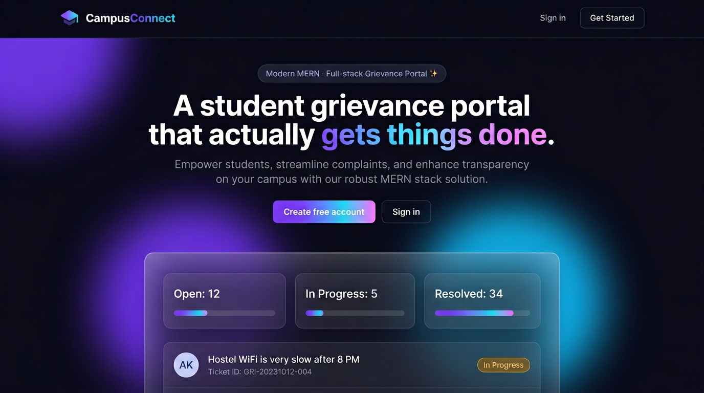
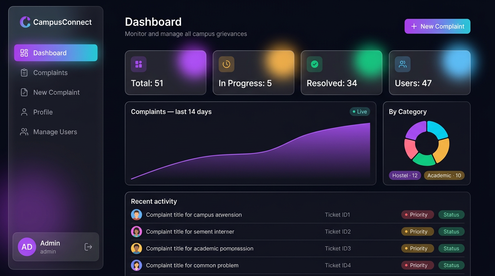
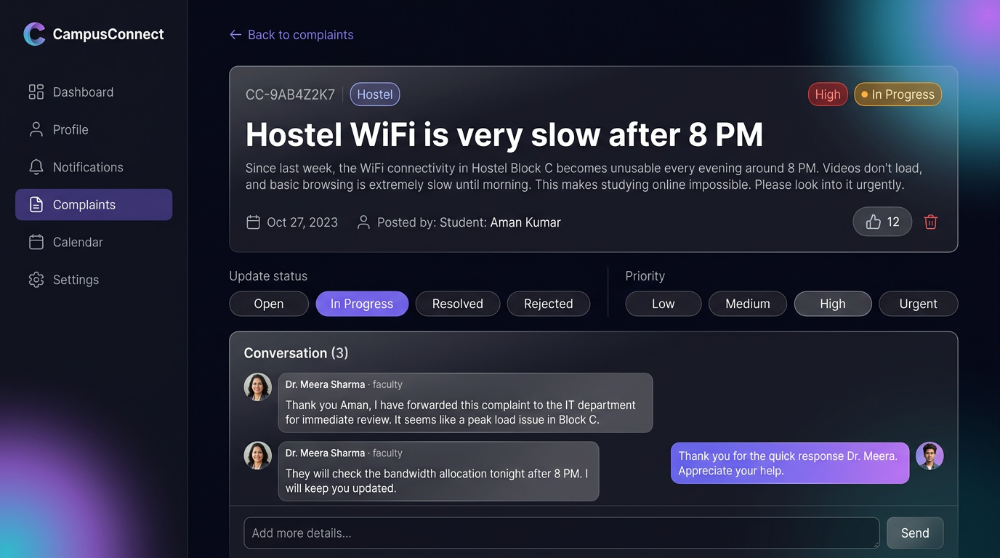
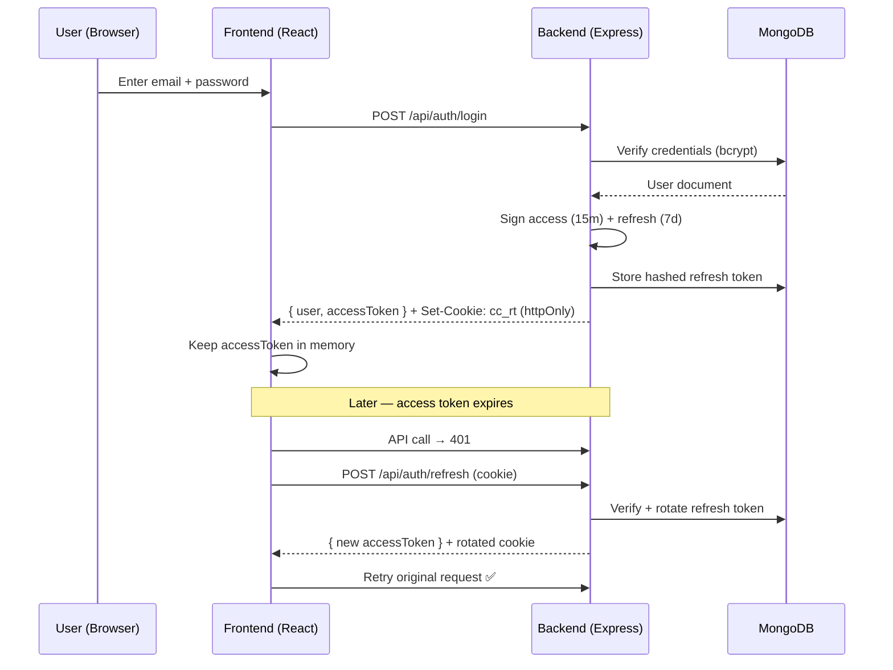

<div align="center">


# 🎓 CampusConnect

### A Modern MERN-Stack Student Grievance Portal

*Raise it. Track it. Resolve it. — all in one beautifully-designed platform.*

[](https://react.dev)
[](https://nodejs.org)
[](https://expressjs.com)
[](https://www.mongodb.com)
[](https://tailwindcss.com)
[](https://jwt.io)
[](./LICENSE)

[**🚀 Live Demo**](#) · [**📸 Screenshots**](#-screenshots) · [**⚡ Quick Start**](#-quick-start) · [**📚 API Reference**](#-api-reference)

</div>

---

## 📌 Overview

**CampusConnect** is a full-stack MERN application built to modernize the way students raise grievances and administration resolves them. It replaces the traditional email/complaint-box mess with a beautiful, transparent, and accountable digital portal — complete with real-time tracking, threaded conversations, role-based dashboards, and live analytics.

> Built as a portfolio-grade project showcasing production patterns: secure JWT auth with refresh-token rotation, role-based access control, aggregation pipelines, and a polished glassmorphism UI.

---

## 📸 Screenshots

<div align="center">

### 🏠 Landing Page

*Modern hero with animated gradient text and a live preview of the dashboard.*



---

### 🔐 Login Page

*Split-layout auth with one-click demo credentials for Student / Faculty / Admin.*

.png)

---

### 📊 Admin Dashboard

*Live KPIs, 14-day trend chart, category donut, and a real-time activity feed.*



---

### 💬 Complaint Detail

*Full ticket view with admin controls and a chat-style conversation thread.*



</div>

---

## ✨ Key Features

### 👨‍🎓 For Students

* 🔐 Secure registration & login with JWT
* 📝 Submit complaints with **category, priority & description**
* 🎭 **Anonymous mode** — hide your identity from faculty (still visible to admin for accountability)
* 📍 Track each complaint from `Open → In Progress → Resolved`
* 💬 Chat-style two-way conversation with faculty/admin
* 👍 Upvote issues raised by other students
* 📜 Full history of your grievances

### 🛡️ For Admin / Faculty

* 📊 **Analytics dashboard** — KPIs, 14-day trend chart, category & priority breakdowns
* 📥 View & filter **all** complaints across campus
* 🎯 Update status, priority & assignments in one click
* 💬 Respond directly on tickets
* 👥 **User management** — role changes, delete accounts (admin only)
* 🔍 Global search + advanced filters + pagination

### 🔒 Security & Engineering

* **Access + Refresh JWT** with **token rotation** on every refresh
* Refresh tokens stored **hashed** in DB, sent as **httpOnly cookies**
* Access token kept **in memory only** (safer from XSS)
* **bcrypt** password hashing (cost 12)
* **Helmet**, **CORS**, and **rate-limiting** on auth routes
* **Role-based access control** at both route and API level
* **express-validator** on all mutating endpoints
* **Silent token refresh** via axios interceptors — seamless UX
* Registration route blocks self-promotion to `admin`

---

## 🛠️ Tech Stack

<table>
<tr>
<td valign="top" width="50%">

### 🖥️ Frontend

* ⚛️ **React 18** (Vite)
* 🎨 **Tailwind CSS 3**
* 🎭 **Framer Motion** (animations)
* 🧭 **React Router 6**
* 📡 **Axios** (with auto-refresh interceptor)
* 📊 **Recharts** (dashboard charts)
* ✨ **Lucide React** (icons)
* 🔔 **React Hot Toast**

</td>
<td valign="top" width="50%">

### ⚙️ Backend

* 🟩 **Node.js 18+**
* 🚂 **Express 4**
* 🍃 **MongoDB 6+** + **Mongoose 8**
* 🔑 **jsonwebtoken** (access + refresh)
* 🔐 **bcryptjs** (password hashing)
* 🛡️ **Helmet** + **CORS** + **cookie-parser**
* 🚦 **express-rate-limit**
* ✅ **express-validator**
* 📝 **Morgan** (logging)

</td>
</tr>
</table>

---

## 📁 Project Structure

```
CampusConnect/
├── backend/                          # Node + Express + Mongoose
│   ├── config/db.js                  # Mongo connection
│   ├── controllers/                  # Business logic
│   │   ├── auth.controller.js
│   │   ├── complaint.controller.js
│   │   ├── user.controller.js
│   │   └── stats.controller.js
│   ├── middleware/
│   │   ├── auth.js                   # JWT protect + role authorize
│   │   ├── validate.js               # express-validator handler
│   │   └── error.js                  # 404 + global error handler
│   ├── models/
│   │   ├── User.js                   # bcrypt hash, safe JSON
│   │   └── Complaint.js              # + responses subdoc + text index
│   ├── routes/                       # /api/auth /complaints /users /stats
│   ├── utils/
│   │   ├── tokens.js                 # sign / verify / rotate
│   │   └── seed.js                   # demo data script
│   ├── .env.example
│   ├── package.json
│   └── server.js                     # entry point
│
├── frontend/                         # React 18 + Vite
│   ├── public/favicon.svg
│   ├── src/
│   │   ├── api/client.js             # axios + refresh interceptor
│   │   ├── components/
│   │   │   ├── AppLayout.jsx         # sidebar + topbar
│   │   │   ├── ErrorBoundary.jsx
│   │   │   ├── Loader.jsx
│   │   │   ├── Logo.jsx
│   │   │   ├── ProtectedRoute.jsx
│   │   │   ├── StatCard.jsx
│   │   │   └── StatusBadge.jsx
│   │   ├── context/AuthContext.jsx   # session bootstrap
│   │   ├── pages/
│   │   │   ├── Landing.jsx
│   │   │   ├── Login.jsx / Register.jsx
│   │   │   ├── Dashboard.jsx         # KPIs + charts
│   │   │   ├── ComplaintsList.jsx    # search + filters + pagination
│   │   │   ├── ComplaintDetail.jsx   # chat + admin controls
│   │   │   ├── NewComplaint.jsx
│   │   │   ├── Profile.jsx
│   │   │   └── AdminUsers.jsx
│   │   ├── App.jsx
│   │   ├── main.jsx
│   │   └── index.css                 # Tailwind + glass styles
│   ├── tailwind.config.js
│   ├── vite.config.js                # proxies /api → :5000
│   └── package.json
│
├── docs/screenshots/                 # UI screenshots
├── preview.html                      # standalone design preview
├── HOW_TO_RUN.md                     # detailed setup guide
└── README.md                         # you are here
```

---

## ⚡ Quick Start

### Prerequisites

* **Node.js** v18+ → [Download](https://nodejs.org)
* **MongoDB** (local) OR free [**MongoDB Atlas**](https://www.mongodb.com/cloud/atlas/register) cluster ✅ *recommended*

### 1️⃣ Clone & install

```bash
git clone https://github.com/ayushu2004/CampusConnect-Student-Grievance-Portal.git
cd CampusConnect-Student-Grievance-Portal
```

### 2️⃣ Backend setup

```bash
cd backend
cp .env.example .env         # Windows: copy .env.example .env
```

Edit `backend/.env` and fill in:

```env
MONGO_URI=mongodb+srv://<user>:<pass>@cluster0.xxxxx.mongodb.net/campusconnect
JWT_ACCESS_SECRET=<any long random string>
JWT_REFRESH_SECRET=<another long random string>
```

> 💡 Generate a secret: `node -e "console.log(require('crypto').randomBytes(48).toString('hex'))"`

Then install, seed & run:

```bash
npm install
npm run seed        # seeds demo users + sample complaints
npm run dev         # starts backend on http://localhost:5000
```

### 3️⃣ Frontend setup (new terminal)

```bash
cd frontend
npm install
npm run dev         # starts frontend on http://localhost:5173
```

### 4️⃣ Open the app

Go to **http://localhost:5173** 🎉

---

## 🔑 Demo Credentials

The Login page has **one-click buttons** to auto-fill these.

| Role              | Email                     | Password      |
| ----------------- | ------------------------- | ------------- |
| 🛡️ **Admin**     | `admin@campusconnect.edu` | `Admin@12345` |
| 👩‍🏫 **Faculty** | `meera@faculty.edu`       | `Faculty@123` |
| 👨‍🎓 **Student** | `ayush@student.edu`       | `Student@123` |

---

## 🔐 Authentication Flow



**Highlights:**

* Access token → **in-memory only** (no localStorage — safer from XSS)
* Refresh token → **httpOnly, SameSite cookie**, scoped to `/api/auth`
* **Rotated on every refresh** — reuse detection possible
* Refresh tokens stored **hashed** on the user document
* Logout clears server-side hash → session fully invalidated

---

## 📚 API Reference

Base URL: `http://localhost:5000/api`

### Auth

| Method | Endpoint         | Auth | Description                          |
| ------ | ---------------- | ---- | ------------------------------------ |
| POST   | `/auth/register` | ❌    | Create student/faculty account       |
| POST   | `/auth/login`    | ❌    | Login → returns accessToken + cookie |
| POST   | `/auth/refresh`  | 🍪   | Rotate tokens (uses cookie)          |
| POST   | `/auth/logout`   | 🍪   | Invalidate refresh token             |
| GET    | `/auth/me`       | 🔑   | Current user                         |

### Complaints

| Method | Endpoint                    | Auth             | Description                      |
| ------ | --------------------------- | ---------------- | -------------------------------- |
| GET    | `/complaints`               | 🔑               | List (with filters & pagination) |
| POST   | `/complaints`               | 🔑               | Create new complaint             |
| GET    | `/complaints/:id`           | 🔑               | Get single complaint             |
| PATCH  | `/complaints/:id/status`    | 👑 admin/faculty | Update status/priority           |
| POST   | `/complaints/:id/responses` | 🔑               | Add reply                        |
| POST   | `/complaints/:id/upvote`    | 🔑               | Toggle upvote                    |
| DELETE | `/complaints/:id`           | 🔑 owner/admin   | Delete                           |

### Users

| Method | Endpoint          | Auth     | Description        |
| ------ | ----------------- | -------- | ------------------ |
| PATCH  | `/users/me`       | 🔑       | Update own profile |
| GET    | `/users`          | 👑 admin | List all users     |
| PATCH  | `/users/:id/role` | 👑 admin | Change role        |
| DELETE | `/users/:id`      | 👑 admin | Delete user        |

### Stats

| Method | Endpoint          | Auth | Description                        |
| ------ | ----------------- | ---- | ---------------------------------- |
| GET    | `/stats/overview` | 🔑   | KPIs + trend + breakdowns (scoped) |

**Query params** on `/complaints`:
`?status=Open&category=Hostel&priority=High&q=wifi&mine=1&page=1&limit=10&sort=-createdAt`

---

## 🎨 Design System

* **Theme:** Dark, glassmorphism, subtle purple → cyan gradients
* **Typography:** Inter (300–800)
* **Palette:**

  * Primary: `#7c3aed` (violet)
  * Accent: `#0ea5e9` (sky) · `#ec4899` (pink)
  * Bg: `#0b0b13` with radial glow overlays
* **Motion:** Framer Motion for page transitions & micro-interactions
* **Components:** Custom `.glass`, `.glass-strong`, `.btn-primary`, `.chip`, `.badge` utilities

---

## 🚀 Deployment

| Layer    | Recommended                                                                              | Free tier |
| -------- | ---------------------------------------------------------------------------------------- | --------- |
| Frontend | [Vercel](https://vercel.com) / [Netlify](https://netlify.com)                            | ✅         |
| Backend  | [Render](https://render.com) / [Railway](https://railway.app) / [Fly.io](https://fly.io) | ✅         |
| Database | [MongoDB Atlas](https://www.mongodb.com/atlas) M0                                        | ✅         |

**Env vars to set on production:**

* `MONGO_URI`, `JWT_ACCESS_SECRET`, `JWT_REFRESH_SECRET`
* `CLIENT_ORIGIN` → your deployed frontend URL
* `NODE_ENV=production` (enables secure cookies)

Update `frontend/vite.config.js` proxy (or set `VITE_API_URL`) to point at your deployed backend.

---

## 🗺️ Roadmap

* [ ] File / image uploads on complaints (Cloudinary or S3)
* [ ] Email notifications on status changes (Nodemailer + Resend)
* [ ] Real-time updates via Socket.IO (live status + typing indicators)
* [ ] PWA support + offline queue
* [ ] Dark/Light theme toggle
* [ ] Export complaints as PDF/CSV
* [ ] Admin category analytics with year-over-year comparison
* [ ] Multi-language (i18n) — Hindi + English

---

## 🤝 Contributing

Contributions are welcome! Please:

1. Fork the repo
2. Create a feature branch (`git checkout -b feature/awesome`)
3. Commit your changes (`git commit -m "feat: add awesome"`)
4. Push to the branch (`git push origin feature/awesome`)
5. Open a Pull Request

---

## 📄 License

Distributed under the **MIT License**. See [`LICENSE`](./LICENSE) for more information.

---

## 👤 Author

**Ayushu Singh**
🌐 GitHub: [@ayushu2004](https://github.com/ayushu2004)
🔗 Project: [CampusConnect – Student Grievance Portal](https://github.com/ayushu2004/CampusConnect-Student-Grievance-Portal)

---

## ⭐ Show Your Support

If this project helped you or you found it useful, please consider **starring** the repository — it really helps! ⭐

<div align="center">

Made with ❤️ using the MERN stack

</div>
